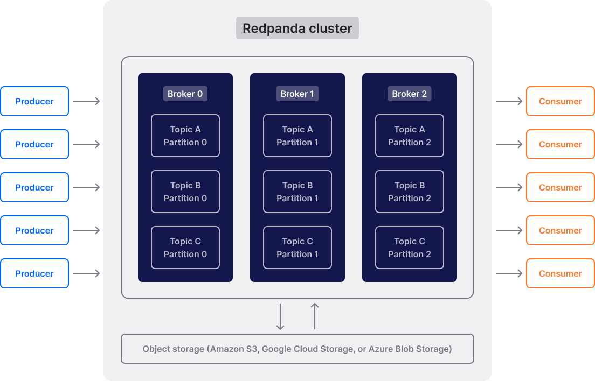

# Паттерн publish-subscribe (pub/sub)

## Схема взаимодействия

```plantuml
participant "Publisher 1" as P1
participant "Publisher 2" as P2
queue broker as B
participant "Subscriber 1" as S1
participant "Subscriber 2" as S2
participant "Subscriber 3" as S3

group топик T1
    P1 -> B : публикация в топик
    
    B -> S1 : получение данных \n из топика
    B -> S3 : получение данных \n из топика
end

group топик T2
    P1 -> B : публикация в топик
    P2 -> B : публикация в топик
    
    B -> S2 : получение данных \n из топика
end
```

Участники одной группы (publisher, producer) **публикуют** данные. Участники второй группы (subscriber, consumer)
**подписываются** на поставку публикуемых данных. Участники не обмениваются данными друг с другом напрямую,
а делают это через **брокера**. 

Следует решить, как поступать с данными в случае нескольких подписчиков. Можно как отправлять копию всех публикуемых
данных каждому подписчику, так и выделять каждому подписчику своё подмножество данных, которое не пересекается
с другими подмножествами. 

Подобная абстракция позволяет двум группам участников отвязаться от поведения друг друга (продюсеру незачем 
знать, что консьюмер будет делать с этими данными, а консьюмеру незачем знать, как организован процесс поставки данных).
Кроме этого, уменьшается зависимость жизненных циклы публикации и обработки данных.

Уже опубликованные, но ещё не востребованные данные нужно хранить в каком-то буфере, и этот буфер может переполниться. 
Нужно продумать, какое поведение ожидается от системы в таком случае.

Можно различать потоки данных, например, чтобы по-разному настраивать размер буфера, или использовать разную
логику обработки данных. Для этого используется абстракция **топик**.

## Реализация на golang

Примером простейшей реализации pub/sub является канал. Канал не предполагает разделения на топики, а каждый подписчик
получает своё подмножество данных.

[Ещё пример кода](./examples/part1), в котором есть разделение на топики, а каждое уведомление получают все подписчики.

Стоит отметить особенность данной реализации: подписчики не получают сообщения, которые были опубликованы
до того, как они подписались.

## Распределённая реализация

В реальных приложения достаточно часто явление, когда продюсеры и консьюмеры являются отдельными приложениями,
расположенными на разных виртуальных нодах. Есть несколько решений, которые часто используются в качестве брокеров.

Можно почитать [статью на медиуме](https://medium.com/redis-with-raphael-de-lio/understanding-pub-sub-in-redis-18278440c2a9)
(англ.). В этой статье проводится обзор того, как pub/sub работает в redis. В частности:

- все активные подписчики получают свою копию опубликованного сообщения
- сообщения нигде не хранятся, т.е., нет возможности получить сообщение, опубликованное до подписки

Другие брокеры, такие как Kafka или RedPanda, имеют специальный буфер для сообщений (логов), 
что позволяет консьюмерам получать доступ к данным в топике, которые были опубликованы до подписки.


